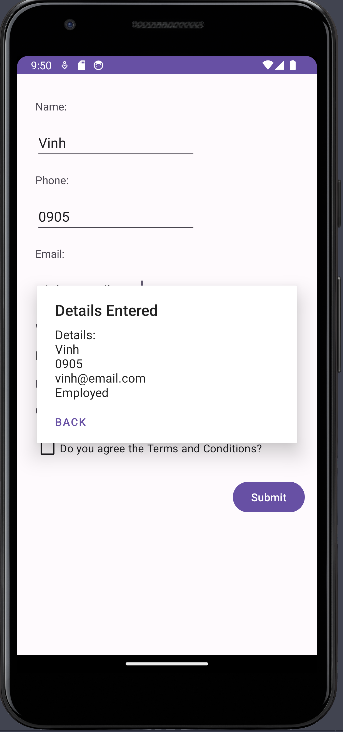

# Create AlertDialog

Now, we will add code to create an AlertDialog to display back to the user what they entered.

In `MainActivity.java`, add the code below:
```java
public class MainActivity extends AppCompatActivity {

    // DatePicker Fragment inside MainActivity
    public static class DatePickerFragment extends DialogFragment implements
    {
        // ...
    }


    public  void updateDOB(LocalDate dob){
        // ...
    }
    // Define variables to reference the layout
    EditText nameInput;
    EditText emailInput;
    EditText phoneInput;
    Spinner sp;
    String workStatus;
    Button submitBtn;
    
    // Define function getInputs() to get values from inputs
    private void getInputs(){
        nameInput = findViewById(R.id.name_input);
        emailInput = findViewById(R.id.email_input);
        phoneInput = findViewById(R.id.phone_input);

        String name = nameInput.getText().toString();
        String email = emailInput.getText().toString();
        String phone = phoneInput.getText().toString();
        workStatus = sp.getSelectedItem().toString();

        // Use function displayNextAlert to display an AlertDialog
        displayNextAlert(name, phone, email, workStatus);
    }

    public void displayNextAlert(String name, String phone, String email, String workStatus){
        new AlertDialog.Builder(this)
                .setTitle("Details Entered")
                .setMessage(
                        "Details: \n" +
                                name + "\n" +
                                phone + "\n" +
                                email + "\n" +
                                workStatus
                        )
                .setNeutralButton("Back", new DialogInterface.OnClickListener() {
                    @Override
                    public void onClick(DialogInterface dialogInterface, int i) {

                    }
                })
                .show();
    }
    TextView dobControl;
    @Override
    protected void onCreate(Bundle savedInstanceState) {
        super.onCreate(savedInstanceState);
        setContentView(R.layout.activity_main);
        // ...
        
        // Refer the Spinner from the layout
        sp = findViewById(R.id.spinner);
        
        // Refer the button from the layout
        submitBtn = findViewById(R.id.submit_btn);
        
        // Adding behavior to the button
        submitBtn.setOnClickListener(new View.OnClickListener() {
            @Override
            public void onClick(View view) {
                getInputs();
            }
        });
    }
}
```

After that, we can display the AlertDialog

