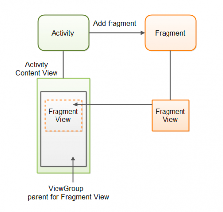

# Checking the checkbox

 We want to ensure that the Alert is only displayed if the user ticks the checkbox
 If the checkbox is not ticked, then a Toast is displayed

To do that, we need to add more behavior to the button

```java
 submitBtn.setOnClickListener(new View.OnClickListener() {
            @Override
            public void onClick(View view) {
                CheckBox cb = findViewById(R.id.checkBox);

                if (!cb.isChecked()){
                    Toast.makeText(
                            MainActivity.this,
                            "You must check the box",
                            Toast.LENGTH_SHORT)
                            .show();
                    return;
                }
                getInputs();
            }
        });
```

After that, we can display a small toast if the checkbox is not checked

