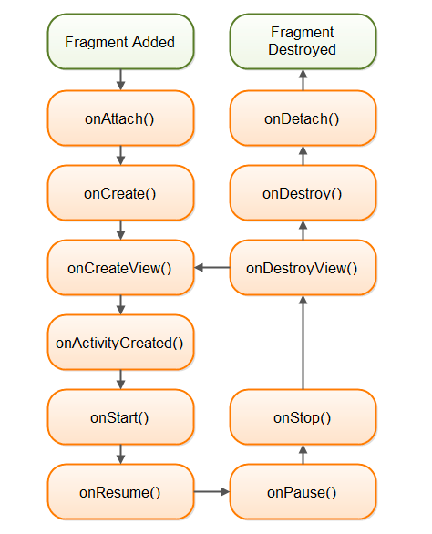
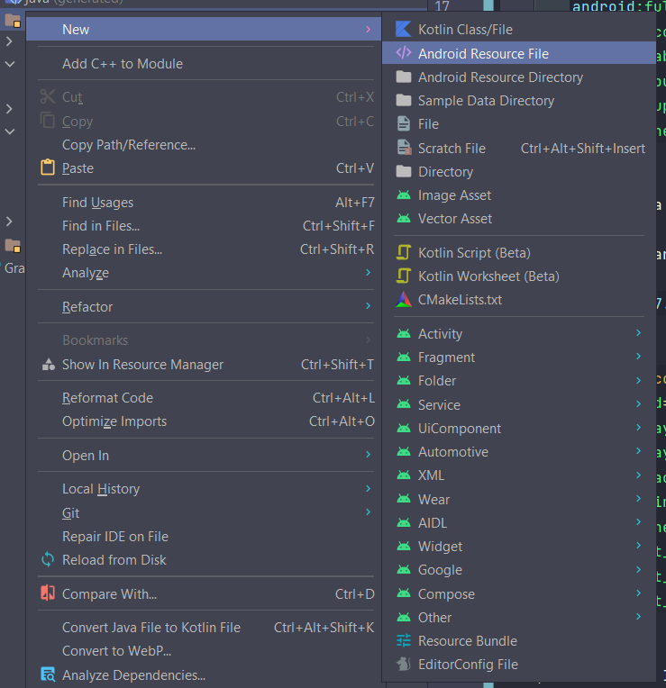
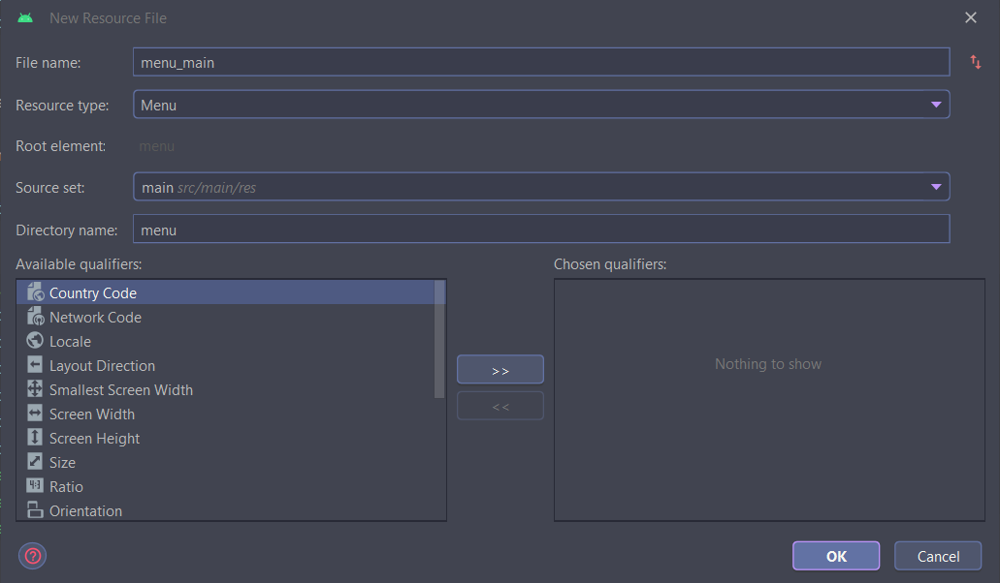
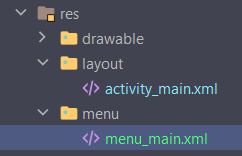
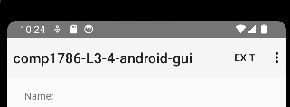
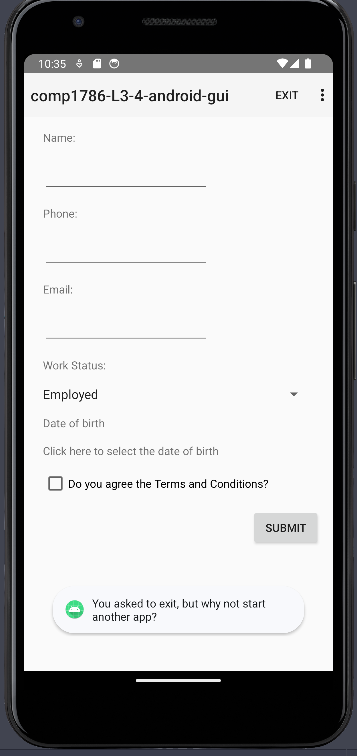

# Create Menus

We will now create a menu with two options:
- Next
- Exit

In an AppCompatActivity we will use a Toolbar to display the menu

We will need to use one of the appcompat’s NoActionBar themes to prevent the app from using the native ActionBar

In `AndroidManifest.xml`, Change the Theme to a NoActionBar theme in the AndroidManifest file

```xml
    <application
        android:allowBackup="true"
        android:dataExtractionRules="@xml/data_extraction_rules"
        android:fullBackupContent="@xml/backup_rules"
        android:icon="@mipmap/ic_launcher"
        android:label="@string/app_name"
        android:roundIcon="@mipmap/ic_launcher_round"
        android:supportsRtl="true"
        android:theme="@style/Theme.AppCompat.Light.NoActionBar"
```

Next we will add a Toolbar to the activity_main layout

You can use drag-and-drop to add this in `activity_main.xml`



```xml
    <androidx.appcompat.widget.Toolbar
        android:id="@+id/toolbar"
        android:layout_width="409dp"
        android:layout_height="wrap_content"
        android:background="?attr/colorPrimary"
        android:minHeight="?attr/actionBarSize"
        android:theme="?attr/actionBarTheme"
        app:layout_constraintEnd_toEndOf="parent"
        app:layout_constraintStart_toStartOf="parent"
        app:layout_constraintTop_toTopOf="parent" />
```

Then, we add Menu Items

Right-click on the `res` folder and select New -> Android Resource File





A menu_main.xml file is created



Now we need to customise the `menu_main.xml`

```xml
<?xml version="1.0" encoding="utf-8"?>
<menu xmlns:app="http://schemas.android.com/apk/res-auto"
    xmlns:android="http://schemas.android.com/apk/res/android">
    <item
        android:id="@+id/itemNext"
        android:title="Next"
        app:showAsAction="never" />
    <item
        android:id="@+id/itemExit"
        android:title="Exit"
        app:showAsAction="ifRoom"/>
</menu>
```

We need to add code to the onCreate() method in MainActivity to initialise the toolbar

```java
// Get a reference from the toolbar
myToolBar = findViewById(R.id.toolbar);

// Set toolbar as actionbar for the activity
setSupportActionBar(myToolBar);
```

We will add an onCreateOptionsMenu() method to display the toolbar
```java
@Override
public boolean onCreateOptionsMenu(Menu menu) {
    getMenuInflater().inflate(R.menu.menu_main, menu);
    return true;
}
```

It will the display the Menu but doing nothing



We will add a method to MainActivity to handle the option selection

```java
    @Override
    public boolean onOptionsItemSelected(@NonNull MenuItem item){
        if (item.getItemId() == R.id.itemNext){
            getInputs();
            return true;
        }
        else if (item.getItemId() == R.id.itemExit){
            Toast.makeText(
                    getApplicationContext(),
                    "You asked to exit, but why not start another app?",
                    Toast.LENGTH_LONG
            ).show();
            return true;
        }
        else {
            return super.onOptionsItemSelected(item);
        }
    }
```

After that, we can use the button on the Menu



