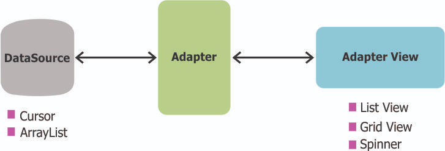

# Add Date Picker

First, we need to add two TextView controls
- One to say "Date of Birth"
- One to show selected data 

```xml
    <TextView
    android:id="@+id/dob_text"
    android:layout_width="wrap_content"
    android:layout_height="wrap_content"
    android:layout_marginStart="24dp"
    android:layout_marginTop="16dp"
    android:text="Date of birth"
    app:layout_constraintStart_toStartOf="parent"
    app:layout_constraintTop_toBottomOf="@+id/spinner" />

    <TextView
    android:id="@+id/dob_control"
    android:layout_width="wrap_content"
    android:layout_height="wrap_content"
    android:layout_marginStart="24dp"
    android:layout_marginTop="16dp"
    android:text="Click here to select the date of birth"
    app:layout_constraintStart_toStartOf="parent"
    app:layout_constraintTop_toBottomOf="@+id/dob_text" />

```

The updated design can be seen


## Fragment in Android

`Fragment` class in Android is used to build dynamic User Interfaces. Fragment should be used within the Activity. 
A greatest advantage of fragments is that it simplifies the task of creating UI for multiple screen sizes. 
A activity can contain any number of fragments. An Android fragment is not by itself a subclass of View which most other UI components are. 
Instead, a fragment has a view inside it. It is this view which is eventually displayed inside the activity in which the fragment lives. 
Because an Android fragment is not a view, adding it to an activity looks somewhat different than adding a view (e.g. TextView). 
A fragment is added to a ViewGroup inside the activity. The fragment’s view is displayed inside this ViewGroup. 
The following diagram shows depicts what happens when a fragment is added to an activity:


## Fragment Lifecycle

Android fragment lifecycle is illustrated in below image.


Then, we will create inner class `DatePickerFragment.java` inside `MainActivity.java`

```java
    // DatePicker Fragment inside MainActivity
    public static class DatePickerFragment extends DialogFragment implements
            DatePickerDialog.OnDateSetListener {
        @NonNull
        @Override
        public Dialog onCreateDialog(@Nullable Bundle savedInstanceState)
        {
            LocalDate d = LocalDate.now();
            int year = d.getYear();
            int month = d.getMonthValue();
            int day = d.getDayOfMonth();
        return new DatePickerDialog(getActivity(), this, year, --month, day);}
        @Override
        public void onDateSet(DatePicker datePicker, int year, int month, int day){
        }
    }
```

Then, we assign `setOnClickListener` to open the `DatePickerDialog`

```java
public class MainActivity extends AppCompatActivity {

    // DatePicker Fragment inside MainActivity
    public static class DatePickerFragment extends DialogFragment implements
    {
        // ...
    }

    TextView dobControl;
    @Override
    protected void onCreate(Bundle savedInstanceState) {
        super.onCreate(savedInstanceState);
        setContentView(R.layout.activity_main);
        dobControl = findViewById(R.id.dob_control);

        dobControl.setOnClickListener(new View.OnClickListener() {
            @Override
            public void onClick(View view) {
                DialogFragment newFragment = new DatePickerFragment();
                newFragment.show(getSupportFragmentManager(), "datePicker");
            }
        });
    }
}
```
Then, we can open `DatePickerFragment`


After that, we need to update the selected date back to the view. First, we have to add function `updateDOB` to `MainActivity.java`
```java
public void updateDOB(LocalDate dob){
    TextView dobControl = findViewById(R.id.dob_control);
    dobControl.setText(dob.toString());
}
```

Then, use it in function `onDateSet` of the fragment
```java
@Override
public void onDateSet(DatePicker datePicker, int year, int month, int day){
    LocalDate dob = LocalDate.of(year, ++month, day);
    ((MainActivity)getActivity()).updateDOB(dob);
}
```

Voila, we can set the selected date back to the view


