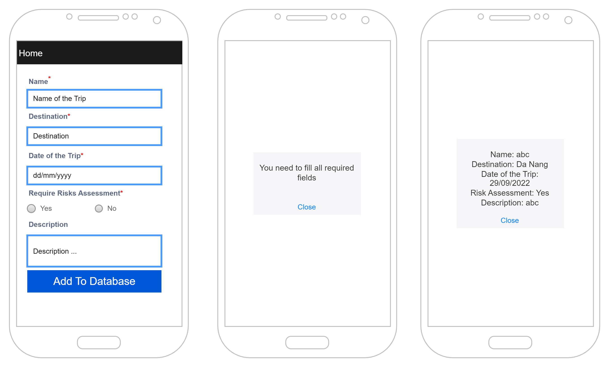
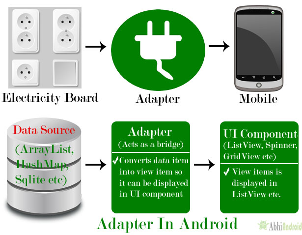

# ListView Example

Change the generated default Activity to inherit from ListView

```java
public class MainActivity extends ListActivity {
```

Right-click on the layout folder and select New -> Layout Resource File




The list_item configuration file defines the view applied to each item in the list

`list_item.xml`

```xml
<?xml version="1.0" encoding="utf-8"?>
<TextView xmlns:android="http://schemas.android.com/apk/res/android"
    android:layout_width="match_parent"
    android:layout_height="match_parent"
    android:padding="10dp"
    android:textSize="16sp"
    android:textColor="#FF0000"
    >

</TextView>
```

Create an array of Strings containing the Days of the Week

```java
public class MainActivity extends ListActivity {
    private static final String[] WEEKDAYS = new String[]{
            "Monday",
            "Tuesday",
            "Wednesday",
            "Thursday",
            "Friday",
            "Saturday",
            "Sunday"
    };

```

Amend the onCreate() method

```java
    @Override
    protected void onCreate(Bundle savedInstanceState) {
        super.onCreate(savedInstanceState);
        //setContentView(R.layout.activity_main);
        setListAdapter(new ArrayAdapter<String>(this, R.layout.list_item, WEEKDAYS));
        ListView lv = getListView();
        lv.setTextFilterEnabled(true);
        lv.setOnItemClickListener(new AdapterView.OnItemClickListener() {
            @Override
            public void onItemClick(AdapterView<?> adapterView, View view, int position, long ig) {
                Toast.makeText(getApplicationContext(),
                        ((TextView)view).getText(), Toast.LENGTH_SHORT
                ).show();
            }
        });
    }
```

Voila,  we can create listView



If you just type a letter, the list is automatically filtered


