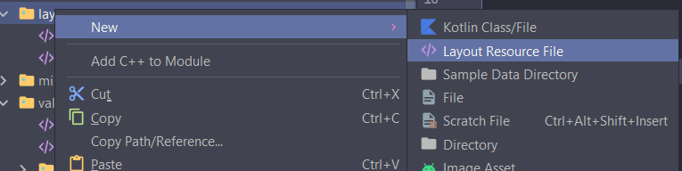

# Populate Spinner through Code

Another way, we can populate data to spinner through code

`MainActivity.java`
```java
public class MainActivity extends AppCompatActivity {
    // Create an array with options
    private String [] workStatus = {"Employed", "Unemployed"};
    Spinner sp;
    @Override
    protected void onCreate(Bundle savedInstanceState) {
        super.onCreate(savedInstanceState);
        setContentView(R.layout.activity_main);

        // Get reference to spinner
        sp = findViewById(R.id.spinner);

        // Create an adapter
        ArrayAdapter<String> dataAdapter = new ArrayAdapter<String>(this,
                android.R.layout.simple_spinner_item, workStatus);
        // Connect adapter to spinner
        sp.setAdapter(dataAdapter);
    }
}
```

The final result can be seen as below:

